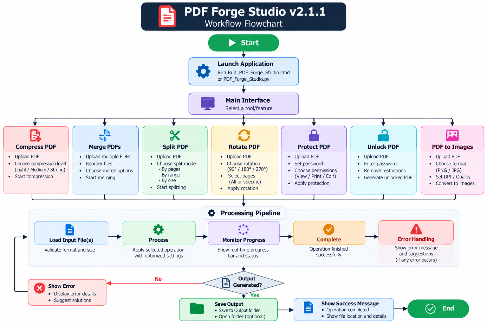

# PDF Forge Studio v2.1.1

> **A local-first Windows desktop application for practical PDF processing and document workflows.**


## Overview

**PDF Forge Studio** is a lightweight Windows desktop utility built with Python for common PDF operations such as compression, merging, splitting, page extraction, rotation, conversion, and document inspection.

The project is designed around a **local-first processing model**: core document operations happen on the user's machine rather than through a remote document-processing service.

The application also includes a Windows-oriented installer/launcher workflow, structured output folders, automatic backups for compression workflows, progress reporting, and local error logging.

---

## Application Preview

### Desktop Interface


### Workflow



---

## Core Features

| Capability | Description |
|---|---|
| PDF Compression | Compress PDFs using predefined quality/size profiles |
| PDF Merge | Combine multiple PDF documents into one |
| PDF Split | Split a PDF into individual pages |
| Page Extraction | Extract selected pages and ranges such as `1,3,5-7` |
| Page Rotation | Rotate pages by 90°, 180°, or 270° |
| PDF → PNG | Render PDF pages to PNG images |
| Images → PDF | Create PDF documents from image files |
| PDF Information | Inspect basic document information/metadata |
| Backup Workflow | Create backups before compression operations |
| Progress Feedback | Show operation progress and status |
| Error Logging | Store application errors in a local log file |
| Safe Outputs | Generate unique output names to reduce accidental overwrites |

---

## Compression Profiles

PDF Forge Studio provides four predefined compression profiles:

| Profile | Target DPI | JPEG Quality | Typical Use |
|---|---:|---:|---|
| **High** | 200 | 90 | Higher visual quality |
| **Medium** | 150 | 80 | General document sharing |
| **Small** | 120 | 70 | Smaller attachments |
| **Very Small** | 100 | 60 | Aggressive size reduction |

> Compression results depend on the source PDF. Scan-heavy/image-heavy documents generally respond differently from text/vector-heavy PDFs.

---

## Technical Architecture

```text
                    ┌──────────────────────┐
                    │      User Input      │
                    │  PDF / Image Files   │
                    └──────────┬───────────┘
                               │
                               ▼
                    ┌──────────────────────┐
                    │   Tkinter Desktop UI │
                    │  Validation / Events  │
                    └──────────┬───────────┘
                               │
                ┌──────────────┼──────────────┐
                │              │              │
                ▼              ▼              ▼
          PDF Operations   Page Operations   Image Operations
                │              │              │
                └──────────────┼──────────────┘
                               ▼
                         ┌───────────┐
                         │ PyMuPDF   │
                         │  Pillow   │
                         └─────┬─────┘
                               │
                               ▼
                  ┌─────────────────────────┐
                  │ Local Windows Filesystem│
                  │ Output / Backups / Logs │
                  └─────────────────────────┘
```

### Processing model

```text
Select input
    ↓
Validate file / parameters
    ↓
Select operation
    ↓
Process locally
    ↓
Monitor progress / status
    ↓
Generate unique output
    ↓
Show result + output location
```

---

## Technology Stack

### Application

- **Python** — application logic
- **Tkinter** — desktop graphical user interface
- **PyMuPDF** — PDF parsing, rendering, and page manipulation
- **Pillow** — image conversion and processing

### Windows Integration

- Windows `.cmd` installer
- Windows `.cmd` launcher
- User-level application storage
- Local filesystem logging
- No administrative privileges required for normal operation

---

## Project Structure

```text
PDF_FORGE_STUDIO_V2.1.1/
│
├── assets/
│   ├── b55a7474-47fa-40aa-bd20-7a6f42117d82.png
│   ├── Info.txt
│   └── Screenshot 2026-10-01 192416.png
│
├── .gitignore
├── Install_PDF_Forge_Studio.cmd
├── PDF_Forge_Studio.py
├── READ_BEFORE_INSTALL.txt
├── README.md
└── Run_PDF_Forge_Studio.cmd
```

Runtime-generated directories are kept outside the source repository:

```text
%USERPROFILE%\Downloads\PDF_Forge_Studio\
├── Output\
├── Backups\
└── Logs\
```

---

## Installation

### Windows Installer

Keep the project files together and run:

```text
Install_PDF_Forge_Studio.cmd
```

The installer checks for Python and installs the required dependencies.

### Manual Installation

Install dependencies:

```bash
python -m pip install pymupdf pillow
```

Run the application:

```bash
python PDF_Forge_Studio.py
```

---

## Development

Clone the repository:

```bash
git clone https://github.com/costaspinto/pdf-forge-studio.git
cd pdf-forge-studio
```

Create a virtual environment if desired:

```bash
python -m venv .venv
.venv\Scripts\activate
```

Install dependencies:

```bash
python -m pip install pymupdf pillow
```

Launch:

```bash
python PDF_Forge_Studio.py
```

Validate syntax:

```bash
python -m py_compile PDF_Forge_Studio.py
```

---

## File Safety & Privacy

PDF Forge Studio follows a local-first workflow.

- Core document processing occurs locally.
- No cloud account is required.
- The application does not intentionally upload document contents to a remote document-processing service.
- Compression creates a backup before modifying the workflow output.
- Output filenames are generated to reduce accidental source-file overwrites.
- Errors are recorded in a local log for troubleshooting.

For sensitive documents, users should still follow their organization's security policies and keep the operating system, Python runtime, and dependencies updated.

---

## Error Handling

Application errors are logged at:

```text
%USERPROFILE%\Downloads\PDF_Forge_Studio\Logs\pdf_forge.log
```

A useful bug report should include:

- Windows version
- Python version
- Feature being used
- Error message / traceback
- Approximate input file characteristics

Do not include confidential documents or sensitive document contents in issue reports.

---

## Engineering Highlights

This project demonstrates practical software engineering across:

- Desktop GUI development
- PDF document processing
- Image processing
- Input validation
- File-system management
- Backup and recovery workflows
- Error handling and logging
- Cross-file application packaging
- Windows installation scripting
- Dependency management
- Local-first privacy design
- Git/GitHub project organization

The implementation intentionally keeps the application lightweight and dependency-focused while providing a practical Windows user workflow.

---

## Design Decisions

### Local-first processing

Document operations are performed locally to avoid requiring a remote document-processing backend for the core use case.

### PyMuPDF for PDF operations

PyMuPDF provides the low-level PDF capabilities needed for rendering, page manipulation, metadata access, and document workflows without introducing a heavyweight service architecture.

### Tkinter for the GUI

Tkinter keeps the desktop application lightweight and available with standard Python installations on Windows.

### Windows CMD launchers

Simple `.cmd` entry points make the application easy to install and run for users who are not working directly from a Python terminal.

---

## Roadmap

Potential future improvements:

- Drag-and-drop PDF support
- Batch compression
- Custom DPI and JPEG quality controls
- Page thumbnails and reordering
- Password-protected PDF workflows
- OCR integration
- PDF/A validation
- Native `.exe` packaging
- Automated unit/integration tests
- GitHub Actions CI
- Signed Windows releases
- Release automation

---

## Version

**Current release: `v2.1.1`**

This release includes a startup compatibility fix for the Windows Tkinter environment encountered during application initialization.

---

## Author

**Costas Pinto**

AI/ML Engineer | Generative AI | LLMs | RAG | Python

- GitHub: https://github.com/costaspinto
- Portfolio: https://costas-portfolio-ai.vercel.app/
- LinkedIn: https://www.linkedin.com/in/costaspinto

---

## License

MIT License.

See [`LICENSE`](LICENSE) for details.

---

## Disclaimer

PDF Forge Studio is provided for general document-processing purposes.

Always retain original documents before performing lossy or destructive operations such as compression or page manipulation.
